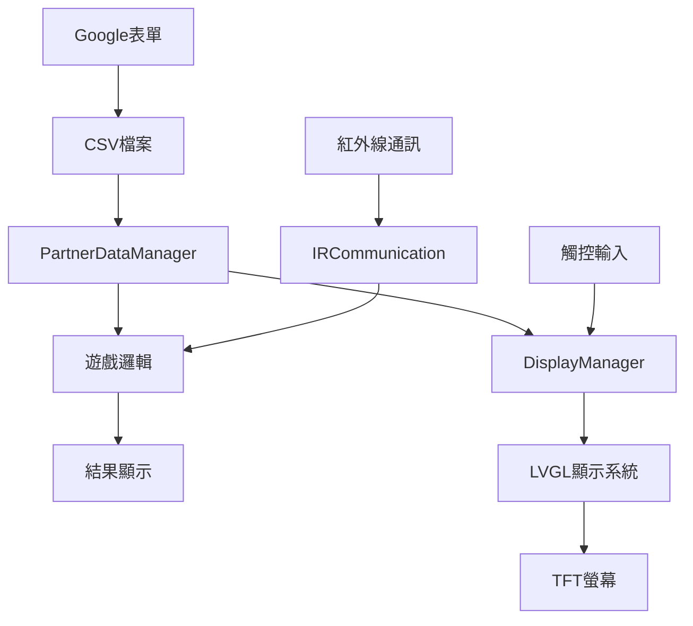

# 派對交流遊戲 - ESP32-S3 圓形LCD版本

## 🎮 遊戲介紹

這是一個創新的派對交流遊戲，參與者透過Google表單填寫個人特徵，然後使用ESP32-S3手錶裝置尋找符合特定特徵的夥伴。遊戲結合了社交互動、推理解謎和科技元素。

## 🛠️ 硬體需求

### 主要元件
- **ESP32-S3 Touch LCD 1.28"** 圓形螢幕開發板
- **CST816S** 電容觸控晶片
- **5mm 紅外線發射器** (940nm)
- **VS1838B** 紅外線接收器
- **3.7V 1200mAh** 鋰電池
- **5mm LED** 狀態指示燈

### 接腳配置
```
ESP32-S3 腳位配置:
├── 觸控介面
│   ├── SDA: GPIO6
│   ├── SCL: GPIO7
│   ├── RST: GPIO13
│   └── IRQ: GPIO5
├── 紅外線通訊
│   ├── 發射: GPIO15
│   ├── 接收: GPIO16
│   └── 狀態LED: GPIO17
├── 電源管理
│   ├── 電池監測: GPIO33
│   ├── VSYS: 3.0V~4.2V
│   └── 3V3: 穩壓3.3V輸出
└── 系統控制
    ├── RESET: 硬體重置
    └── BOOT: GPIO0 (下載模式)
```

## 📋 遊戲流程

### 1. 資料準備階段
1. 參與者填寫Google表單，包含10個特徵：
   - 伴侶狀態 (Single/Not Single)
   - 寵物 (Have/Don't have)
   - 壞習慣 (Smoker/Not)
   - MBTI人格 (4個維度)
   - 性別 (Male/Female)
   - 身高 (<=170cm/>170cm)
   - 配飾 (Wear glasses/No glasses)

2. 將Google表單匯出為CSV檔案
3. 將CSV資料載入到ESP32-S3裝置中

### 2. 遊戲進行階段
1. **啟動**: 裝置顯示啟動畫面
2. **資訊顯示**: 顯示目標夥伴的5個特徵 (隱藏5個)
3. **掃描配對**: 透過紅外線掃描其他玩家
4. **配對檢測**: 觸控螢幕進行配對檢查
5. **結果處理**:
   - 正確: 顯示"MATCH!"
   - 錯誤: 顯示"X"並揭露一個隱藏特徵
6. **遊戲結束**: 最多錯3次，或成功配對

## 🔧 安裝說明

### 1. 開發環境設置
```bash
# 安裝Arduino IDE或PlatformIO
# 安裝ESP32開發板支援包
# 安裝必要程式庫：
- LVGL (8.3.0+)
- TFT_eSPI
- IRremote
```

### 2. 程式庫相依性
```cpp
// 在Arduino IDE中安裝以下程式庫：
- LVGL by kisvegabor
- TFT_eSPI by Bodmer  
- IRremote by shirriff
```

### 3. 編譯設定
1. 選擇開發板: "ESP32S3 Dev Module"
2. 設定分割: "Default 4MB with spiffs"
3. 上傳速度: 921600
4. CPU頻率: 240MHz

### 4. 檔案結構
```
Partner characteristics/
├── PartnerGame.ino          # 主程式
├── PartnerData.h/.cpp       # 資料管理
├── DisplayManager.h/.cpp    # 顯示系統
├── IRCommunication.h/.cpp   # 紅外線通訊
├── Config.h                 # 系統設定
├── Partner characteristics.csv # 測試資料
└── README.md               # 說明文件
```

## 🎯 使用方式

### Google表單設置
1. 建立Google表單，包含以下問題：
   ```
   - 伴侶狀態: Single / Not Single
   - 寵物: Have / Don't have  
   - 壞習慣: Smoker / Not
   - MBTI(E/I): Extraversion(E) / Introversion(I)
   - MBTI(N/S): Intuition(N) / Sensing(S)
   - MBTI(T/F): Thinking(T) / Feeling(F)
   - MBTI(J/P): Judging(J) / Perceiving(P)
   - 性別: Male / Female
   - 身高: <=170cm / >170cm
   - 配飾: Wear glasses / No glasses
   ```

2. 匯出回應為CSV格式

### CSV資料格式
```csv
時間戳記,Partner,Pet,Bad habit,MBTI(E/I),MBTI(N/S),MBTI(T/F),MBTI(J/P),Gender,Height,Accessories
2025/8/13 下午 5:36:35,Single,Don't have,Smoker,Introversion(I),Intuition(N),Thinking(T),Judging(J),Male,<=170cm,Wear glasses
```

### 操作說明
1. **開機**: 長按電源鍵啟動
2. **選單**: 觸控螢幕選擇"開始遊戲"
3. **查看特徵**: 閱讀顯示的5個特徵資訊
4. **掃描**: 觸控進入掃描模式，尋找其他玩家
5. **配對**: 找到目標後觸控進行配對檢查
6. **重複**: 配對失敗會獲得新提示，繼續嘗試

## 🔍 除錯功能

### 序列埠監控
```cpp
// 啟用除錯輸出
#define DEBUG_ENABLED 1
#define DEBUG_IR 1
#define DEBUG_GAME 1
```

### 狀態指示
- **LED熄滅**: 空閒狀態
- **LED快閃**: 掃描/連接中
- **LED恆亮**: 已連接
- **LED慢閃**: 錯誤狀態

### 常見問題
1. **觸控無回應**: 檢查CST816S接線
2. **紅外線無法通訊**: 確認VS1838B方向和電源
3. **螢幕顯示異常**: 檢查TFT_eSPI設定
4. **記憶體不足**: 減少LVGL緩衝區大小

## 📊 系統架構



## 🔋 電源管理

- **工作電流**: ~150mA (螢幕開啟)
- **待機電流**: ~20mA (螢幕關閉)
- **電池容量**: 1200mAh
- **續航時間**: 約6-8小時連續使用
- **低電壓保護**: 3.3V自動關機

## 📝 開發注意事項

1. **記憶體管理**: LVGL需要足夠的RAM，注意緩衝區大小
2. **中斷處理**: 觸控和紅外線使用中斷，避免阻塞
3. **電源效率**: 適當使用休眠模式延長電池壽命
4. **除錯輸出**: 生產版本記得關閉序列埠輸出

## 📈 未來擴展

- [ ] WiFi連接，線上同步資料
- [ ] 藍牙通訊，替代紅外線
- [ ] 更多遊戲模式
- [ ] 統計分析功能
- [ ] 多語言支援

## 📄 授權

本專案採用 MIT 授權條款。

## 👨‍💻 作者

開發者: AI助手
版本: 1.0.0
更新日期: 2025年1月
